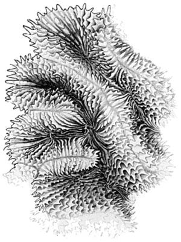
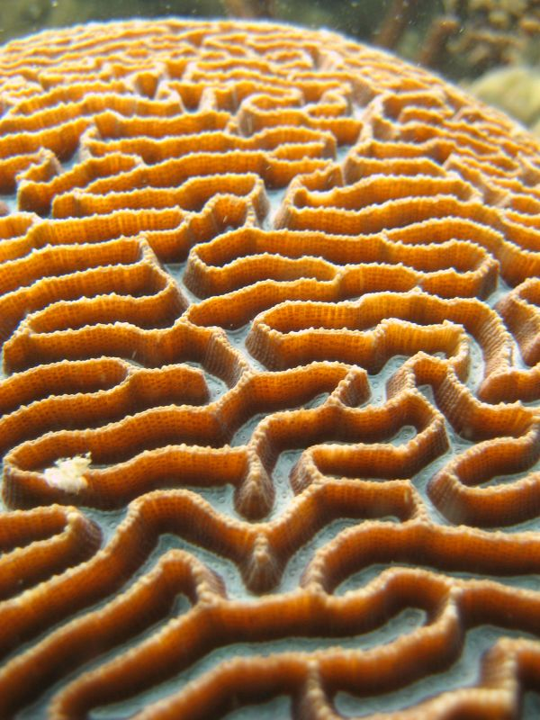

Inspiration
===========

#### Meandroid ####

I stumbled upon it when browsing a page about [Colony Formation](http://coral.aims.gov.au/info/structure-colony.jsp)   
Looks like it's a part of stony coral known as [Platygyra](http://es.wikipedia.org/wiki/Platygyra):

Those corals form little labyrinths in their own right.  
They also look very much like some kind of Turing patterns.

