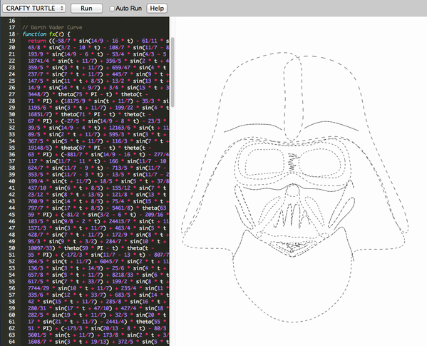

Inspiration IV
==============

Ariadne's thread follows a continuous meandering path through the labyrinth.
This trajaectory can be described by a mathematical function.

#### Functional Drawing ####

 [Maillardet's Automaton](http://www.fi.edu/learn/sci-tech/automaton/automaton.php?cts=instrumentation) is a little robot draftsman, created in 1810.
 
 

It is programmed to create drawings like this one:

The motion of this device is controlled by functions encoded in the shape of cams or cogwheels. Those functions can be desinged to simulate the irregular trajectories of human movement, a principle that is also used in the [Unreliable Machinery Project](http://www.nand.io/awareness/unreliable-machinery).

#### Functional Embroidery #####

Here's a little screenshot from my [TurtleCraft Sandbox](https://github.com/bitcraftlab/turtlecraft), showing a sketch that uses mathematical functions to create an embroidery design.

The function shown here was created from an input image by Wolfram Research.
See the excellent [Making Formulas](http://blog.wolframalpha.com/2013/05/17/making-formulas-for-everything-from-pi-to-the-pink-panther-to-sir-isaac-newton/) post on the Wolfram Alpha blog for more information on how to create functional imagery.

#### Functional Calligraphy

I love the concentrated look od this guy, who seems to be able to draw periodic curves with the precision of a machine.
 

In comparison Maillardet's automaton is a really sloppy calligrapher.

#### Lissajou Figures

If you use periodic functions like sine and cosine to control both horizontal and vertical motion you get what is known as Lissajou figures. Those also used in [Lissajou-Do](http://nunchaku.wikia.com/wiki/Lissajous-do) a martial arts technique, where you defeat your opponent with mathematical beauty!

#### Guioche

Beautiful copper plates with [guioche](http://de.wikipedia.org/wiki/Guilloche) engravings from 1880 can be found [here](http://auction.archivesinternational.com/Cycloid-Designs-for-counters-and-borders-on-Copper-Plate_i11387431).
Also make sure to watch this DIY Drawing Machine by the folks at [Resonance Studio](http://www.resonancestudio.com/):

http://www.youtube.com/watch?v=BG9e06IWAxE#t=47

#### Vignettes

Here is a collection of calligraphic vignettes that are created from a single continuous curve:

These kind of Vignettes inspired me to create the Vignette Explorer:

I like to call my vignettes hypercycloids because they are generalization of [cycloids](http://en.wikipedia.org/wiki/Cycloid) to higher dimensions. 
Imagine a spirograph, where the small gears contain even smaller gears and so on until infinity. The result is a curly fractal.
You can find my Vignette Explorer on [OpenProcessing](http://www.openprocessing.org/sketch/34403).

