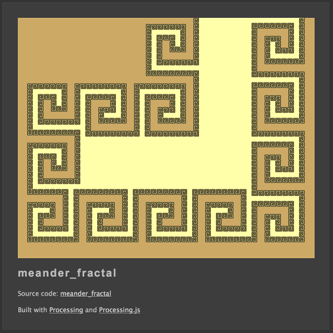
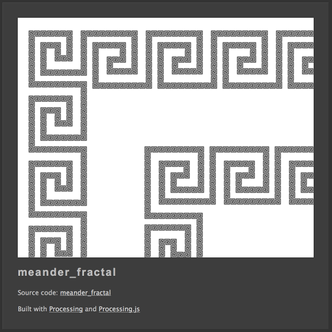
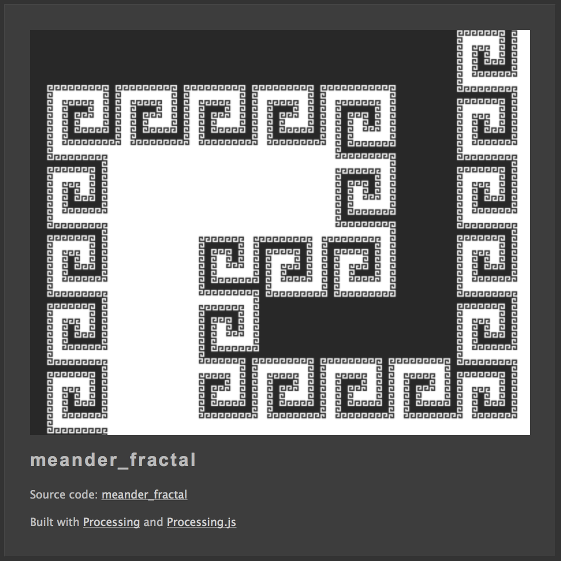

Fractal Meander
===============

### Heureka!

Without further ado, i'd like to present the **Meander Fractal**:

This is a remarkable discovery, since fractals and decorative designs used to live in seperate worlds. Now this is the kind of fractal I always hoped to find in the literature, but never did!

I handcrafted some kind of fractal meander for the title page when I started onto this quest because I knew what I was looking for, but now that I unearthed the generative principle, I can create fractal meanders of arbitrary degree!

### Other Versions

#### Fractal Line

#### Fractal Surface

