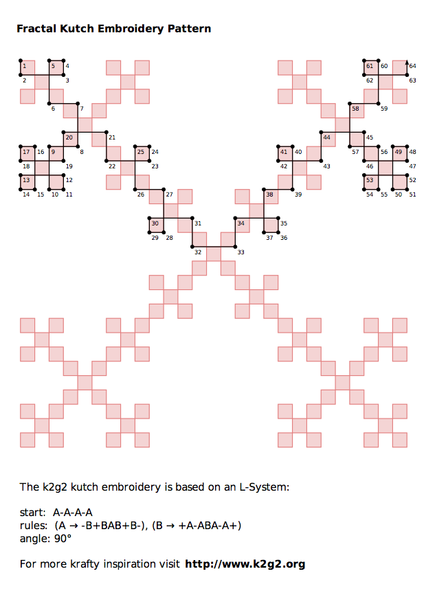

Inspiration V
=============

### The Snowflake of Tamás Vicsek

Fractal embroidery seems to have popped up again and again all over planet earth at places as diverse as India, Armenia and Hungary. I could not find any literature about that, so I'll just provide a few visual cues.

First a picture of the [Vicsek Fractal](http://en.wikipedia.org/wiki/Vicsek_fractal) also known as Box Fractal, so you know what we're looking for:

* [Box Fractal](http://mathworld.wolfram.com/BoxFractal.html) at Mathworld
* [Box Fractal](http://en.wikipedia.org/wiki/Box_fractal) at Wikipedia

### Niches of Fractal Embroidery 

#### Kutch Embroidery

The [Kutch district](en.wikipedia.org/wiki/Kutch%20district) in western India is famous for its traditional embroidery techniques.

 

* [Kutchwork Tutorial Blog](http://kutchwork-tutorial.blogspot.de) by [Bhavani Harikrishnan](https://plus.google.com/+BhavaniHarikrishnansuhabhava)

* Pattern from my [Fractal Kutch Embroidery Howto](www.k2g2.org/howto:fractal_kutch_embroidery)

#### Kasuti Embroidery

* [Kasuti Blog](http://kasuti.blogspot.com) by Bhavani Harikrishnan
* [Pinterest Board](http://www.pinterest.com/isiscat/embroidery-indian-kasuti-patterns/) dedicated to Kasuti Patterns

#### Armenian Embroidery

#### Temari Embroidery

[Temari](http://en.wikipedia.org/wiki/Temari_%28toy%29) is the japanese art of spherical embroidery.

More of those beautiful balls in [this flickr set](http://www.flickr.com/photos/nanaakua/sets/72157617114284128)

## Cropcircles Take Command

I just discovered a fantastic collection of images on some Crop-Circle Website. It seems like alien lifeforms share my obsession with this meanderous fractal ;)

Check out [The Labyrinth Knots' Crop Circle](http://www.cropcircleconnector.com/2012/cheesefoothead1/comments.html) and your command key will never look the same again...
 
#### Crop Circles 

#### Labyrinth Design

#### Command and Conquer

