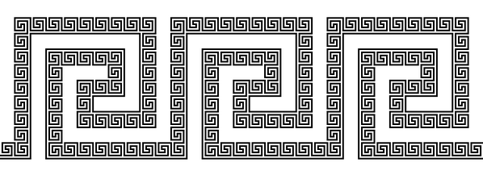

Fractal Meander II
==================

## Meander's Quest

I'm not the first person who went on the quest to discover the fractal meander.
Jo Edkins tried to find it, refering to the meander as the [Greek key](http://en.wikipedia.org/wiki/Greek_key_%28art%29), since the meandering frieze ornament was quite popular in ancient Greece.

Jo's webpage is a treasure trove of interactive little sketches, including generators for meandering frize patterns:

* [1D Frieze Generator](http://gwydir.demon.co.uk/jo/greekkey/compare.htm)
* [2D Frieze Generator](http://gwydir.demon.co.uk/jo/greekkey/plane.htm)

#### Cutting Corners

As Edkins states on her website: 

    A Greek key is notoriously difficult to turn round corners
    
So Edkins went for an approach that does not even try to fill the corners with a meandering path.

This fractal is quite far from what what we are looking for, but it's straight forward to generate programatically. Edkins posted a 4th iteratiopn version of it [here](http://gwydir.demon.co.uk/jo/greekkey/fractal4.gif).
Note that this image is already 10.000 x 10.000 pixels large, since these fractals grow exponetially in size.

#### First Attempts

Edkins attempted to assemble the basic units by hand, but as she says:
    
    While making the previous fractal, I spent much time on the corners, generally failing.
    
Here is her attempt, that looks kind of right, but if you expect it closely, it's not exactly balanced, and has some tiny defects:

A half-hearted attempt at creating a fractal meander was undetaken by Sharon Fay, as illustration for a paper titled [Standards and Reuse](http://www.ibm.com/developerworks/rational/library/2277.html)

## Finding the Fractal Frieze  

So here is how I found the fractal frieze.

#### Playing with Pixels

First I played around with the Frize creates by Edkins, in the hope to remove the defects in her pattern, and possibly repair them.
The result looked like this:

Actually this is the pattern I used for the cover page of the *Meandering Code Project*, in lack of THE REAL THING. Note how I'm cheating, adding a second to balance out the white parts. So it's really a different kind of 2nd iteration meander, and not even a complete one. (Can you see which part is missing?)	

#### The Meander Code

So I threw away the whole thing, and started from scratch.
I created a Processing sketch with a little turtle to follow my drawing commands.
Then I created three commands: One for drawing a straight frieze, one for the left turn, and one for the right turn.

Upon closer inspection of the corners I found that each of them can clearly be seen as continuation of either the horizontal or the vertical streight part.
However the parts would still not match up.

To make it work you woul	d have to add an additonal step in some places, but not in others.
The key was to realize, that there is no way to create the meander from a single motif.
However you can create one using TWO motifs, the curly motive based on a sqare tile and two  connector motives, that serve to glue the squares together.

This is actually quite similar to the way the [Hilbert Curve](http://en.wikipedia.org/wiki/Hilbert_curve) is created by turtle instructions.

#### What's next?

I will provide a more detailled write-up of the construction over at [bitcraftlab](http://www.bitcraftlab.com) soon. 
The DevArt project ends here, but I will continue my explorations [here](http://github.com/bitcraftlab/meandering-code)

