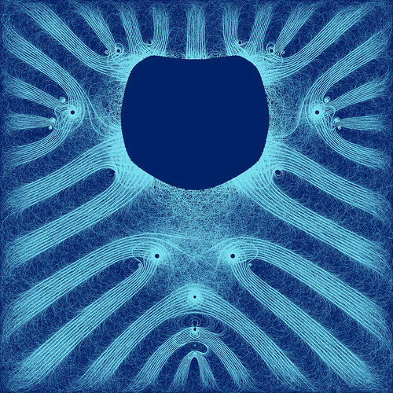
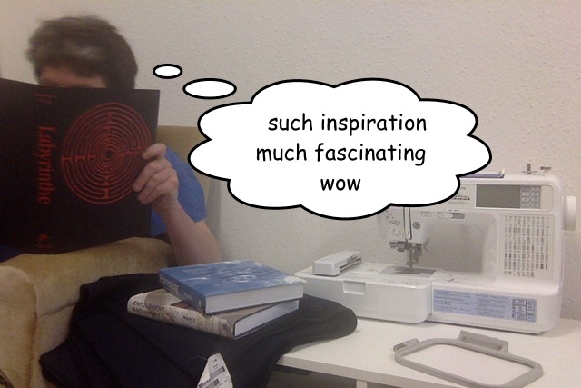

Augmented Embroidery
====================

A simple embroidered labyrinth will probably lack the kind of interactivity, that makes *DevArt* so much fun. So I sketched some ideas that would be great to explore in an exhibition context

### Connect the Dots

In the center of the labyrinth there's an EmbroiderCam installed, taking photos of people. 

You can get a print out on Embroidery-Paper, or even better actual fabric, and a small set with a needle and thread, so you can connect the dots and embroidery our own computational portrait at home To identify your embroidery paper, there could be an other camera + screen at the exit, that uses OpenFrameworks + OCR to show an Augmented Reality Preview of the embroidery, by virtually connecting the dots.

### Threads of Light

I was thinking of adding an additional layer of video projection to the fabric...

Little ariadne's threads wiggeling their way through the walls defined by the embroidery. Those threads may even behave like lively little maze-worms, swarming around in the labyrinth, fleeing the visitors, or following them around.

The worm could become so dense as to to turn into animated Flowfields,
similar to the one I have been exploring [here](http://www.k2g2.org/blog:bit.craft:codex_processianus).

### Thank You!

**Thanks to everyone who took part in this for their efforts and inspiration!**

I'm pretty happy with the meander fractal I discovered, but the actual work is really just     beginning. I hopy my wanderings through the labyrinths have inspired some of you, to do your own explorations in computational craft!

*-- Martin*

